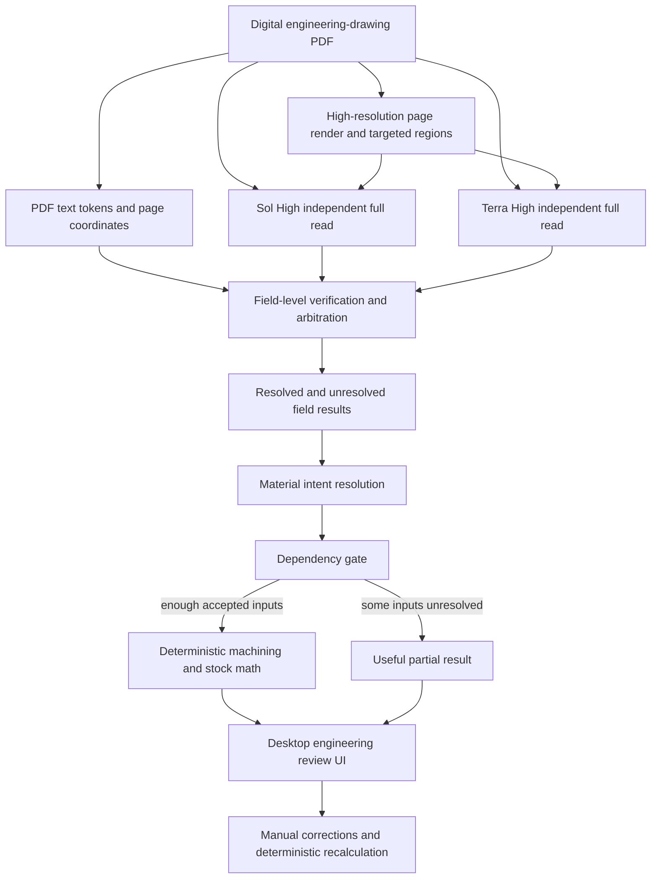

# Machinable authoritative build brief

## Status and authority

This document is the single authoritative build brief for
`027-machinable-for-build-week`. It replaces earlier versions of the brief.

Implement only in:

`/Users/garronware/dev/my-repos/027-machinable-for-build-week`

Use the legacy application only as read-only reference material:

`/Users/garronware/dev/my-repos/015-machinable-app`

Do not create or modify files in `015-machinable-app`.

## Product objective

Build a desktop-first web application that converts one digitally generated
engineering-drawing PDF into the most useful raw-material recommendation the
available evidence supports.

The application should resolve and display, independently:

- part name;
- part number;
- primary units;
- exact material callout and detailed material identity;
- probable stock shape and supplier-facing form;
- finished-part bounding dimensions;
- any explicit stock-size callout on the drawing;
- machining allowance;
- nearest standard stock size;
- cut length; and
- bar yield where applicable.

The system must remove Werk24 and Anthropic completely. This includes any
processing step whose only purpose was adapting, reshaping, correcting, or
normalizing their output.

Use:

- `gpt-5.6-sol` with `high` reasoning; and
- `gpt-5.6-terra` with `high` reasoning.

Both models are independent full drawing readers. Preserve the proven
deterministic machining allowance, stock lookup, cut-length, drop-length, saw
kerf, end-trim, and yield logic unless an interface change is required.

McMaster-Carr and Alro integrations are not required for the MVP. Internal
material and stock contracts should preserve supplier search terms and allow a
future supplier catalog to replace the local data source without changing the
drawing-reading contract.

## Critical product rule: field-level results

The drawing does not receive one global pass/fail decision that erases useful
work. Part identity, units, material, shape, dimensions, and explicit stock
callouts are independently resolvable fields.

Each field must have its own status and evidence. A failure in one field must
not discard successful results from another field.

In particular:

> Failure to resolve dimensions must not prevent the application from
> resolving and displaying material and stock shape.

If material and shape resolve but dimensions do not, return a useful partial
result such as:

```text
Material identified: 6061 Aluminum Alloy
Suggested supplier description: 6061-T6 Aluminum Round Bar
Stock shape: Round Bar
Stock size: Needs dimensional review
```

Withhold only outputs that directly depend on unresolved inputs. For example,
unresolved dimensions normally block machining-adjusted stock size, cut length,
drop length, and yield. They do not block an agreed part number, material, or
shape.

An optional top-level presentation state may summarize the result as
`COMPLETE`, `PARTIAL_SUCCESS`, or `UNSUPPORTED`, but it must be derived from the
field states and must never cause resolved fields to be discarded.

## Current 027 foundation to preserve

The repository already contains useful working behavior:

- a FastAPI `/analyze` route;
- one GPT-5.6 Sol Responses API PDF call;
- strict Pydantic structured output;
- fields for part identity, units, material, shape, dimensions, evidence,
  warnings, conflicts, and derivation paths;
- validation that blocks missing, conflicting, or outline-only dimensions from
  reaching stock calculations;
- deterministic machining allowance;
- deterministic flat and round stock lookup using local CSVs;
- metric conversion;
- cut length, standard drop length, saw kerf, end trim, and 12-foot bar yield;
- an Expo PDF picker and result flow that may be used as behavioral reference;
- offline tests;
- an opt-in paid evaluation harness; and
- a local drawing corpus.

Do not restart the backend or rewrite working deterministic shop math merely to
make the architecture look new. Do not invest further in Expo as the production
frontend; it is now a behavioral reference while the desktop web UI is built.

`part-prints/print-index.md` is the sole authoritative source of expected
finished-part bounding dimensions for evaluation. It must never be used at
runtime or included in model prompts.

## End-to-end architecture



## Layer 0: document evidence

### Original input

The MVP accepts digitally generated PDFs. Keep the original PDF as an input to
both model readers. The OpenAI Responses API processes PDFs using both extracted
text and page images on vision-capable models.

Use `store: false`. Do not retain uploaded drawings or raw provider responses
without an approved retention policy.

### Deterministic PDF text witness

Extract the PDF text layer before or alongside the model calls with a library
such as PyMuPDF. Preserve:

- exact raw tokens;
- normalized numeric forms without replacing the raw text;
- diameter and other dimension symbols;
- unit declarations;
- material text;
- part identity text;
- page number; and
- token bounding boxes or page coordinates.

This witness can establish whether claimed text appears in the PDF. It cannot
reliably determine which axis a dimension belongs to and is not a replacement
for visual readers.

Use it to check:

- whether a claimed number exists;
- whether declared chain operands exist;
- whether a material or part-number callout exists;
- whether units are explicitly declared; and
- whether a reader transposed or invented a token.

Do not add OCR to the default digital-PDF path unless evaluation shows that
required content is absent from the text layer.

### Rendering and targeted regions

Render full PDF pages at high resolution for reliable desktop preview and model
inspection. For dense or multi-page drawings, generate targeted crops or tiles
for:

- title blocks;
- general notes and material notes;
- primary orthographic views;
- dimension-heavy regions;
- tabulated-dimension tables; and
- sections or details relevant to a disagreement.

The complete drawing remains available to both readers. A crop supplements the
full drawing and must not remove the surrounding context needed to interpret a
dimension.

Measure the token, latency, and quality cost of additional image inputs. Do not
send every possible crop when the original PDF is already sufficient.

Official OpenAI references:

- [GPT-5.6 model guidance](https://developers.openai.com/api/docs/guides/model-guidance?model=gpt-5.6)
- [File inputs](https://developers.openai.com/api/docs/guides/file-inputs)
- [Image and vision inputs](https://developers.openai.com/api/docs/guides/images-vision)

## Layer 1: two independent spatial readers

Run two independent full reads, preferably concurrently:

```text
Reader A: gpt-5.6-sol, reasoning effort high
Reader B: gpt-5.6-terra, reasoning effort high
```

Both calls must:

- receive the same original drawing;
- receive semantically equivalent drawing rules;
- independently attempt every safety-critical field;
- use the Responses API;
- use strict Pydantic Structured Outputs;
- use `store: false`;
- preserve evidence, alternatives, and uncertainty; and
- run without seeing the other reader's output.

Do not decompose the work into non-overlapping jobs such as Terra reading only
the title block while Sol reads only dimensions. There must be overlapping
evidence for field-by-field comparison.

These are independent passes, not independent ground truth. Sol and Terra are
from the same provider and family, so correlated errors remain possible and
must be measured.

Both readers should independently attempt:

- part name;
- part number;
- primary units;
- exact raw material callout;
- material evidence location;
- probable stock shape;
- supplier-facing stock form;
- candidate bounding dimensions;
- explicit drawing-specified stock dimensions, when present;
- evidence location for each value;
- alternative interpretations;
- warnings and conflicts; and
- unsupported-input reasons.

Preserve both original typed reader results before normalization or arbitration.

Official OpenAI reference:

- [Structured Outputs](https://developers.openai.com/api/docs/guides/structured-outputs)

## Shared reader contract

Both readers must return the same core contract. Field names may evolve during
implementation, but this information must survive the model boundary:

```text
DrawingRead
  reader_model
  part_number_candidate
  part_name_candidate
  primary_units
  material_callout_raw
  material_callout_evidence
  shape_candidate
  supplier_form_candidate
  projection
  identified_views[]
  dimension_claims[]
  proposed_bounding
  drawing_stock_callout
  tabulated_dimension_evidence[]
  warnings[]
  conflicts[]
  unsupported_reason
```

### Compact dimension claim

Do not require a speculative pixel-level geometry graph for the MVP. Use a
compact, auditable claim:

```text
DimensionClaim
  claim_id
  axis: DIAMETER | THICKNESS | WIDTH | LENGTH
  value
  units
  source:
    EXPLICIT_OVERALL
    EXPLICIT_OUTERMOST_FEATURE
    RECONCILED_ACROSS_VIEWS
    CHAINED_DIMENSIONS
    INFERRED_OUTLINE
    NOT_FOUND
  view
  evidence
  uncertainty
  chain_terms[]
    raw_text
    value
    units
    evidence
  arithmetic
```

For an explicit overall, `chain_terms` is empty. When a reader derives an
overall from chained dimensions, it must provide numeric operands and explicit
arithmetic.

Dimension chaining is supporting evidence, not the preferred primary method.
Prefer explicit overall dimensions. Do not require either reader to reconstruct
every possible chain before returning other useful fields.

### Drawing interpretation rules

The authoritative model prompt must enforce these rules for both readers:

- Assume third-angle projection unless the drawing explicitly says otherwise.
- Prioritize vector/text content, explicit dimensions, title blocks, and notes
  before visual inference.
- Reconcile front, top, right-side, section, detail, and auxiliary views.
- Use the maximum external extents of the finished part.
- Do not include internal holes, slots, pockets, chamfers, local steps, or
  feature locations unless they define the external boundary.
- Prefer explicit overall dimensions.
- When an overall must be derived, sum only same-axis segments on one relevant
  external extent and show the arithmetic.
- Do not guess through conflicting views or ambiguous callouts.
- Preserve uncertainty at the affected field instead of failing unrelated
  fields.
- Never use scale alone to invent a dimension.

Keep one shared authoritative rule definition or one shared core plus clearly
identified reader-strategy additions. Do not create competing prompt copies.

## Tabulated drawings

Tabulated dimensions require an explicit selector-resolution step.

The reader must:

1. Identify the table and the meaning of its first or key column.
2. Determine whether rows are selected by part number, item number, size code,
   dash number, or another referenced standard identifier.
3. Identify the target selector from the title block, drawing callouts, or the
   uploaded part identity.
4. Select the matching row or rows.
5. Resolve lettered dimensions from the selected row before calculating an
   envelope.
6. Preserve the selector, selected row, column headers, letter-to-value mapping,
   and evidence.

Examples:

- A Cummins table headed `PART NO.` or `ITEM NO.` is selected by the target
  part/item number.
- A Titan table whose key header references `AS4395` uses an applicable size or
  dash code. Match each drawing callout such as `AS4395-08` to the corresponding
  row before resolving `A`, `B`, `E`, `J`, or other lettered dimensions.
- If one finished part references different size codes at different features,
  resolve each feature against its applicable row. Do not assume one row per PDF
  or select the first row by default.

If a referenced standard is needed to understand a selector or omitted
definition, consult an authoritative standards source. Do not silently infer a
standard's meaning from a familiar-looking number.

## Explicit drawing stock callouts

An engineer-specified stock size is a separate fact from the finished-part
bounding envelope.

Preserve:

- the exact stock callout;
- stock shape/form;
- dimensions;
- source page and location;
- both readers' evidence; and
- whether it agrees with the calculated minimum stock.

Do not treat a raw stock callout as a finished-part dimension. When both readers
agree on an explicit stock callout, the UI may display it even if finished-part
dimensions need review. Label its source as drawing-specified and do not present
it as a newly calculated value.

When a deterministic recommendation is also available, compare the two. A
drawing-specified stock size that fails to contain accepted finished dimensions
or machining allowance requires review; it must not be silently replaced.

## Layer 2: field-level verification and arbitration

Verification occurs after extraction and before material intent resolution or
stock lookup.

Resolve every field independently:

```text
part_number.status
part_name.status
units.status
material_callout.status
shape.status
dimensions.diameter.status
dimensions.thickness.status
dimensions.width.status
dimensions.length.status
drawing_stock_callout.status
```

Recommended field states:

```text
RESOLVED
NEEDS_REVIEW
MISSING
UNSUPPORTED
```

Every field result retains:

- Sol's raw candidate and evidence;
- Terra's raw candidate and evidence;
- normalized accepted value when available;
- validation checks;
- ambiguity or disagreement reason; and
- user correction, if one is later supplied.

### Practical checks

Use executable checks where evidence is reliable:

- agreement between readers;
- agreement with PDF text;
- exact unit conversion and unit consistency;
- positive numeric dimensions;
- documented plausible-value guardrails;
- required dimension count for the proposed stock shape;
- diameter symbols and round-stock evidence;
- direct overall dimensions versus inferred chains;
- duplicate or contradictory dimension claims;
- material and shape compatibility;
- confidence and evidence quality;
- presence of declared chain operands in PDF text;
- chain arithmetic; and
- downstream stock containment.

Do not pretend deterministic code can prove extension-line geometry or axis
attribution when that evidence came from the models. Do not make a complete
deterministic dimension-chain reconstruction an MVP prerequisite.

### Normalization

Normalize only after preserving raw observations:

- inch and metric values into a comparison unit;
- part-number punctuation and whitespace;
- capitalization and insignificant spacing;
- common dimension notation; and
- documented rounding noise.

Do not normalize materially different values or strings into agreement.

### Field decision policy

| Reader/check state for one field | Field result |
|---|---|
| Same required fact with compatible evidence | `RESOLVED` |
| Same numeric value after exact unit conversion | `RESOLVED` |
| Documented rounding-only difference | `RESOLVED`, retaining both raw values |
| Different units or materially different values | `NEEDS_REVIEW` |
| Same chain total but different operands | `NEEDS_REVIEW` for that dimension |
| One reader misses a field the other finds | `NEEDS_REVIEW` or `MISSING`, retaining the candidate |
| PDF text lacks a claimed explicit token | `NEEDS_REVIEW` |
| Declared arithmetic is invalid | Reject that candidate for the affected field |
| Unsupported drawing/input condition | `UNSUPPORTED` for affected processing |

Never silently choose the larger dimension. Never silently replace one
reader's result with the other's result.

A disagreement on one dimension must not downgrade agreed material, shape,
units, or identity fields.

### Optional targeted disagreement audit

A third model call may receive the original drawing and both typed candidates
to explain a specific disagreement. This is an audit, not an independent reader
because it sees both answers.

Do not run it on every drawing. Evaluate it separately and add it only when its
quality gain justifies latency and cost. It may improve the review explanation;
it must not automatically release a stock recommendation unless a hard,
documented policy invalidates one candidate.

## Layer 3: material resolution and purchasing intent

Material interpretation is a core product capability, not merely mapping a
callout into a broad machining-allowance category.

First reconcile the exact raw callout from Sol and Terra. Then resolve that
accepted callout into detailed identity and supplier-facing language.

The material result should preserve:

```text
MaterialResult
  status
  raw_callout
  raw_callout_evidence[]
  canonical_grade
  standard_system
  material_family
  temper_or_condition
  specification
  resolved_identity
  supplier_description
  supplier_search_terms
    mcmaster_carr
    alro
  allowance_class
  resolution_basis
  resolution_confidence
  ambiguities[]
  temper_source
  temper_confirmation_required
  sources[]
```

Resolution must distinguish:

- exact specified material;
- recognized equivalent;
- probable interpretation;
- commonly stocked condition;
- suggested substitute; and
- unresolved ambiguity.

Do not silently invent a temper or condition. If a drawing says only `6061`, a
valid partial result may say:

```text
Drawing callout: 6061
Resolved identity: 6061 Aluminum Alloy
Suggested purchasing description: 6061-T6 Aluminum Round Bar
Qualification: T6 is a common stocked condition but was not specified
Confirmation required: Yes
```

The exact detailed identity remains available after mapping into a broad
allowance class such as `ALUMINUM`.

Use deterministic mappings for unambiguous known grades, aliases, and material
codes. For obscure, numeric, incomplete, or ambiguous callouts, use a separate
server-side material intent step and consult authoritative standards,
manufacturer technical data, credible cross-reference sources, and supplier
catalogs. Preserve source links and distinguish evidence from inference.

The material intent step receives the accepted raw callout and resolved shape;
it does not reread the drawing. If the allowance class remains unresolved, only
allowance-dependent outputs are blocked. The raw callout, probable identity,
shape, and ambiguity must still be displayed.

## Layer 4: deterministic shop calculations

The calculated stock recommendation requires:

- resolved units;
- resolved allowance class;
- resolved stock shape; and
- sufficiently reliable required bounding dimensions.

When those dependencies resolve:

1. Convert accepted facts into a cylinder or rectangular envelope.
2. Circumscribe a turning-controlled rectangular cross-section with
   `hypot(thickness, width)` when required.
3. Add the material-specific machining allowance.
4. Convert inch-based allowance correctly for metric drawings.
5. Select the smallest local standard stock size that contains the adjusted
   envelope.
6. Use adjusted length as cut length.
7. Select the closest useful standard drop length.
8. Calculate 12-foot bar yield using documented saw kerf and end trim.
9. Format a plain supplier-facing and shop-floor recommendation.

Mandatory invariants:

- adjusted dimensions contain finished dimensions;
- selected stock contains adjusted dimensions;
- metric conversions are correct;
- allowance matches material class and process;
- selected stock is the smallest valid listed size;
- cut length equals adjusted length;
- yield includes kerf and end trim; and
- missing or out-of-table stock fails clearly at that output field.

Keep the current material-blind local stock CSV lookup for the MVP.

## Dependency-aware partial results

When dimensions are unresolved:

- return resolved identity, units, material, and shape;
- return an agreed drawing-specified stock callout, if present;
- explain which dimension fields need review;
- list only the downstream outputs that are blocked;
- allow manual dimension entry or correction; and
- recalculate downstream outputs without rerunning successful model work.

When material remains ambiguous but dimensions resolve:

- return identity, units, shape, and dimensions;
- show the raw material callout and ambiguity;
- block allowance, calculated stock size, cut length, and yield if they depend
  on an unknown allowance class; and
- allow material correction followed by deterministic recalculation.

Manual corrections must be clearly attributed to the user and must not rewrite
or conceal the original reader results.

## API contract

Return a typed response whose field results are authoritative:

```text
AnalysisResponse
  analysis_id
  presentation_status: COMPLETE | PARTIAL_SUCCESS | UNSUPPORTED
  part_number: FieldResult
  part_name: FieldResult
  units: FieldResult
  material: MaterialResult
  shape: FieldResult
  dimensions: DimensionFieldResults
  drawing_stock_callout: FieldResult
  recommendation: Recommendation | null
  blocked_outputs[]
  reader_summaries
    sol
    terra
  validation_summary
  warnings[]
  requires_machinist_verification: true
```

`PARTIAL_SUCCESS` is not a generic error. It returns HTTP success with resolved
fields and structured review information. Provider failures, malformed
responses, invalid uploads, and server errors remain distinct operational error
responses.

Provide a deterministic recalculation endpoint or equivalent typed operation
that accepts user corrections plus the previously resolved field values. It
must not rerun successful model work unless the user explicitly requests a new
analysis.

Do not retain an uploaded drawing or raw model response merely to support
recalculation. The MVP may keep the editable analysis state in browser memory
and send the required typed facts back for server-side validation and math.

## Desktop frontend direction

The production frontend is a desktop-first Next.js/React web application. Expo
and React Native are not long-term requirements. Existing Expo screens may be
used only as behavioral references while the web application replaces them.

Target deployment architecture:

```text
Vercel
Next.js/React desktop frontend
        |
        v
Railway
Existing Python FastAPI backend
        |
        +-- OpenAI readers
        +-- PDF evidence
        +-- verification and arbitration
        +-- material resolution
        +-- deterministic machining and stock logic
```

Do not rewrite the FastAPI backend into Vercel functions for the MVP.

### Production screen structure

Process one drawing at a time:

1. Upload or drag-and-drop a PDF.
2. Show analysis progress by stage.
3. Display the drawing on the left.
4. Display extracted fields and recommendations on the right.
5. Highlight only fields that need review.
6. Allow corrections and deterministic recalculation.
7. Show the final recommendation when enough dependencies resolve.
8. Offer an expandable explanation of reader evidence and validation.

A partial result should resemble:

```text
PART
Part name: Shaft
Part number: 12345

MATERIAL
Drawing callout: 6061
Resolved material: 6061 Aluminum Alloy
Suggested supplier request: 6061-T6 Aluminum Round Bar
Note: T6 inferred as a common stocked condition; confirm before ordering

SHAPE
Round Bar
Status: Resolved

DIMENSIONS
Status: Needs review
Reader disagreement detected
[Review dimensions] [Enter dimensions manually]

STOCK RECOMMENDATION
Pending dimensional confirmation
```

Do not hide resolved fields behind a generic error screen.

### Visual design

The production UI should feel like precise, contemporary B2B engineering
software.

Use:

- a white primary background;
- white or very light neutral-gray surfaces;
- Helvetica, Arial, or a native system sans-serif stack;
- approximately 13-14px body text;
- approximately 11-12px secondary labels;
- generous white space;
- thin solid light-gray borders;
- clean grid alignment;
- restrained status colors;
- minimal or no shadows; and
- normal capitalization.

Do not use:

- brown, tan, beige, cream, or mustard as the main palette;
- Courier, monospace, typewriter, receipt, or terminal fonts;
- dashed ticket borders;
- dot leaders;
- paper textures;
- blueprint or vintage-industrial styling;
- excessive all-caps text;
- oversized mobile-style controls; or
- dense cards nested inside cards.

The existing multi-fixture reports and diagnostic views are internal developer
tools, not the production customer UI. Preserve them when useful for evaluation.

## Evaluation

Evaluate capabilities independently, not only the final stock size:

- title-block extraction;
- units;
- part name;
- part number;
- exact raw material callout;
- detailed material resolution;
- supplier-facing material translation;
- shape and stock form;
- each bounding dimension;
- tabulated-row selection;
- explicit stock callout extraction;
- reader agreement and correlated error;
- field-level partial-success behavior;
- machining allowance;
- standard stock lookup;
- cut length;
- drop length; and
- yield.

Required fixture types include:

- material and shape resolved while dimensions need review;
- dimensions resolved while material remains ambiguous;
- one reader missing a field the other finds;
- numeric material codes with possible missing punctuation;
- drawings that omit temper or condition;
- one-field disagreement with agreement elsewhere;
- tabulated drawings selected by part/item number;
- tabulated drawings selected by standards-based size code;
- a detail-view diameter that is not the overall diameter;
- values printed near the wrong feature;
- chained overall lengths;
- a protrusion omitted from an apparent principal-view overall;
- turning-controlled prismatic geometry;
- dual-unit and multi-page drawings;
- explicit drawing stock-size callouts;
- missing material callouts;
- castings, forgings, handwritten drawings, and other unsupported inputs; and
- repeated runs of known stochastic failures.

Do not tune prompts to filenames, part numbers, or expected answers. Do not
change `print-index.md` or model output to hide a mismatch.

### Controlled paid evaluation

Paid calls require explicit user approval with the models, case count, repeat
count, and expected cost/latency exposure stated in advance.

Compare on the same versioned cases:

1. preserved single-Sol baseline;
2. Sol High alone with the shared contract;
3. Terra High alone with the shared contract;
4. Sol High plus Terra High field agreement;
5. agreement plus PDF text and arithmetic checks; and
6. optional targeted disagreement audit, evaluated separately.

Measure:

- exact or within-tolerance dimension matches;
- undersized, oversized, and missing dimensions;
- identity, unit, raw-material, material-class, and shape accuracy;
- tabulated-selector accuracy;
- reader disagreement and correlated wrong agreement;
- complete-result rate;
- partial-result usefulness;
- blocked-output correctness;
- silent-wrong recommendation rate;
- repeatability;
- latency; and
- model cost per useful result.

Silent undersizing remains the primary safety metric. Useful partial results are
preferred over either a confident wrong recommendation or a generic failure.

## Implementation sequence

### Phase 1: audit and freeze the current baseline

Before implementation:

1. Read the route, model client, prompt, contracts, domain pipeline, frontend,
   evaluation harness, and tests.
2. Run `make check` without paid calls.
3. Compare the repository with this brief.
4. Record implemented, partial, conflicting, missing, and intentionally deferred
   behavior.
5. Preserve historical evaluation outputs.
6. Propose exact file paths and purposes before creating files.

Deliver the audit before implementation.

### Phase 2: field-level contracts and shared reader schema

1. Replace all-or-nothing drawing results with field-level states.
2. Preserve raw reader candidates and evidence.
3. Add the shared Sol/Terra core contract.
4. Add raw material callout and evidence.
5. Add structured chain terms and tabulated-dimension evidence.
6. Add drawing-specified stock callouts.
7. Add offline schema and dependency tests.

### Phase 3: deterministic PDF evidence

1. Extract tokens, page numbers, and coordinates.
2. Normalize numeric forms while preserving raw text.
3. Add token and title-block evidence queries.
4. Add page rendering and targeted-region support.
5. Add offline tests with approved synthetic PDFs or fixtures.

### Phase 4: symmetric Sol and Terra readers

1. Migrate Sol to the shared contract and `high` reasoning.
2. Add Terra using the same core rules and `high` reasoning.
3. Ensure neither reader sees the other result.
4. Run independent calls concurrently where safe.
5. Handle timeout, refusal, incomplete output, and schema failure per reader.
6. Preserve `store: false` and uploaded-drawing privacy.

### Phase 5: field-level arbitration

1. Normalize comparable values.
2. Compare fields independently.
3. Validate PDF text evidence and declared arithmetic.
4. Apply the field decision policy.
5. Compute blocked outputs from unresolved dependencies.
6. Preserve useful partial results.
7. Add offline tests for every decision path.

### Phase 6: material resolution

1. Reconcile exact raw material callouts.
2. Apply deterministic mappings for known grades and codes.
3. Add sourced intent resolution for ambiguous callouts.
4. Produce detailed identity, supplier language, search terms, and allowance
   class.
5. Qualify inferred tempers, conditions, equivalents, and substitutes.
6. Preserve unresolved material information as a useful partial result.

### Phase 7: reconnect deterministic calculations and corrections

1. Feed only resolved dependencies into existing shop math.
2. Preserve allowance, metric conversion, stock lookup, cut, drop, and yield.
3. Compare drawing-specified stock with calculated stock when both exist.
4. Add manual correction and deterministic recalculation without rerunning
   successful model work.
5. Add end-to-end API tests with fake readers.

### Phase 8: desktop Next.js UI

Before styling, confirm the screen structure and visual direction with the user.

1. Build the desktop split view.
2. Add PDF upload, drag-and-drop, preview, and progress.
3. Render resolved and needs-review fields together.
4. Add manual corrections and recalculation.
5. Render final recommendations and explicit stock callouts.
6. Add expandable evidence and validation details.
7. Test complete, partial, unsupported, provider-error, and retry flows.

### Phase 9: controlled evaluation and deployment

1. Request approval for the exact paid-call plan.
2. Run treatments against the same versioned cases.
3. Report full field outputs, accuracy, partial-result usefulness, latency, and
   cost.
4. Keep the simplest architecture that satisfies this brief and the measured
   safety requirements.
5. Prepare the Next.js frontend for Vercel and FastAPI backend for Railway.
6. Do not claim deployment until a real deployment is verified.

## Smallest first implementation slice

After the Phase 1 audit is approved, the first coherent slice should normally
include:

```text
field-level result contracts
+ shared Sol/Terra reader contract
+ structured chain and tabulated evidence
+ Terra independent reader
+ deterministic per-field comparison
+ dependency-based blocked outputs
+ offline tests with fake readers
```

It should not yet include the optional third audit call, live supplier APIs,
deployment, persistence, or speculative geometry reconstruction.

## Hard constraints

1. Werk24, Anthropic, Claude, and Werk24-shaped compatibility objects must not
   appear in the runtime.
2. Model calls, tools, and credentials remain server-side.
3. Use the Responses API and strict Pydantic Structured Outputs.
4. Use deterministic Python for arithmetic, conversion, geometry, allowance,
   stock selection, cut length, and yield.
5. Never use `print-index.md` at runtime.
6. Never silently substitute one reader's result for the other's result.
7. Never discard resolved fields because an unrelated field failed.
8. Never convert missing or disputed facts into dependent calculated outputs.
9. Default tests remain deterministic, offline, and free of paid calls.
10. Paid evaluation remains explicit and versioned.
11. Preserve uploaded-drawing privacy and use `store: false`.
12. Require machinist verification before material is ordered or cut.
13. Do not claim production readiness without supporting evidence.

## MVP definition of done

The MVP is complete when:

- Sol High and Terra High independently read the same critical fields;
- both use one shared strict core contract and authoritative drawing rules;
- deterministic PDF evidence supplies text tokens and page coordinates;
- tabulated drawings preserve selector and row evidence;
- direct dimensions are preferred and any used chains expose operands and math;
- arbitration produces independent field states rather than one destructive
  pass/fail result;
- material resolution preserves exact callouts, detailed identity, qualified
  inference, supplier language, and allowance class;
- dimension failures still return resolved material, shape, identity, units,
  and explicit stock callouts;
- blocked outputs match unresolved dependencies;
- manual corrections trigger deterministic recalculation without repeating
  successful model work;
- accepted inputs flow through the existing deterministic shop calculations;
- the desktop Next.js UI shows complete and partial results together;
- the UI follows the approved contemporary B2B visual direction;
- offline tests cover contracts, evidence, readers, arbitration, material,
  partial success, shop math, API states, and UI-critical response types;
- `make check` passes;
- paid evaluation results, when authorized, report full field outputs,
  accuracy, partial-result usefulness, latency, and cost;
- no secrets, unauthorized drawings, or unapproved raw responses are retained;
  and
- remaining safety risks and unsupported inputs are stated plainly.

## Immediate next action

Do not begin implementation immediately after rewriting this brief.

First:

1. Show the user what this consolidated brief preserved, removed, and changed.
2. Receive approval of the consolidated brief.
3. Perform the Phase 1 read-only repository audit.
4. Present implemented, partial, conflicting, and missing behavior.
5. Propose exact modification and creation paths, offline tests, and the paid
   evaluation plan.
6. Confirm the desktop screen structure and visual direction before frontend
   styling.

Only then implement one coherent phase at a time.
